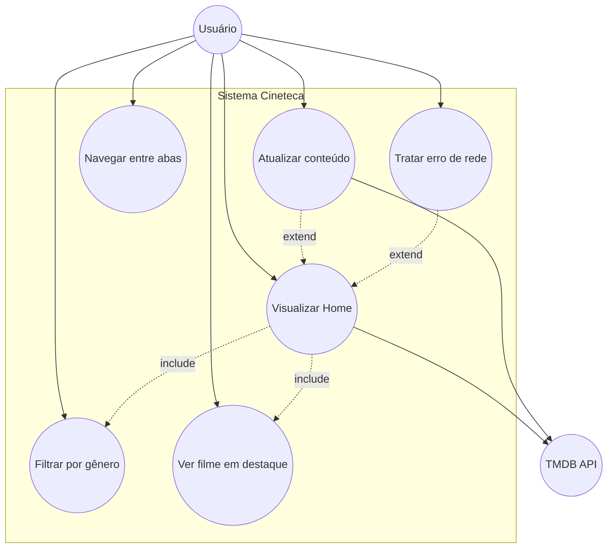
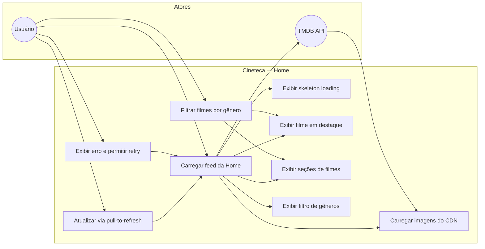
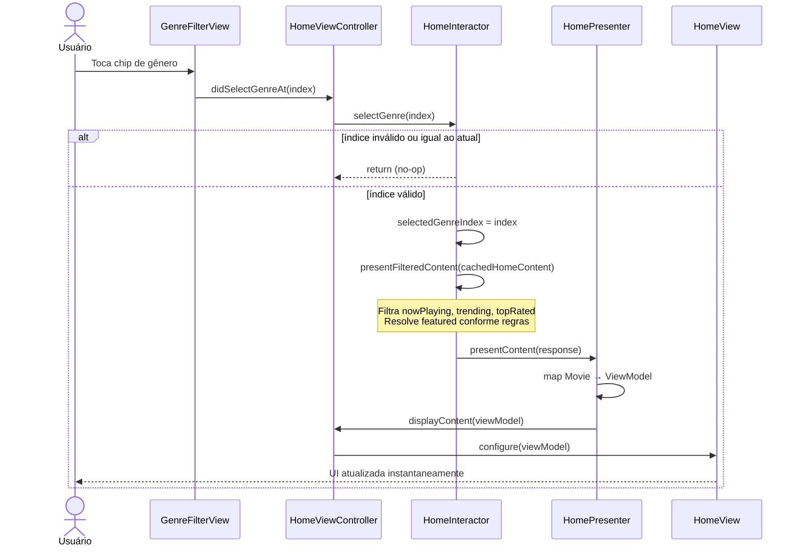
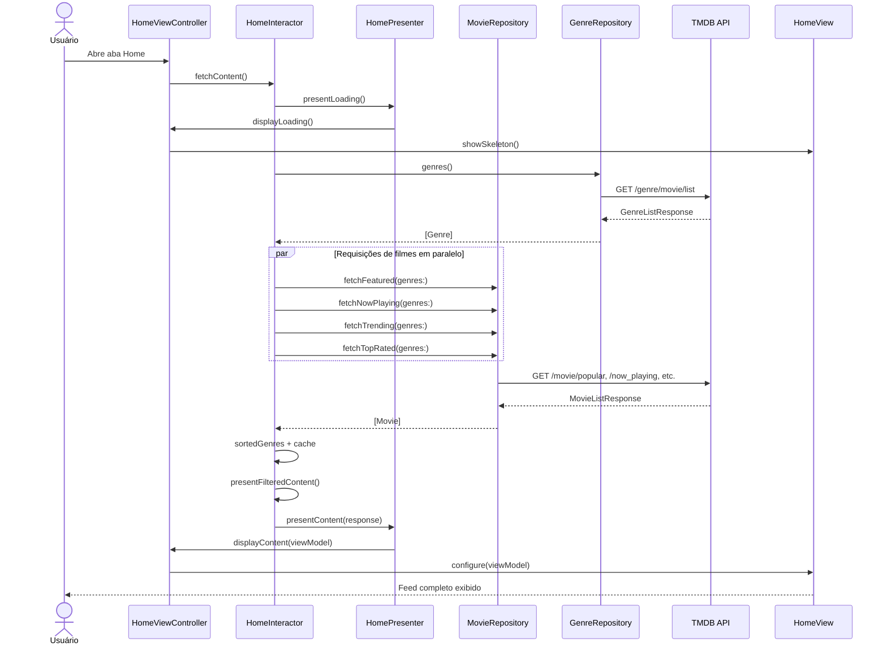
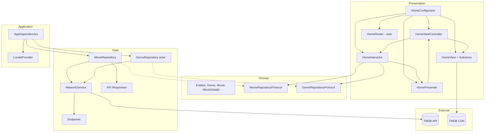
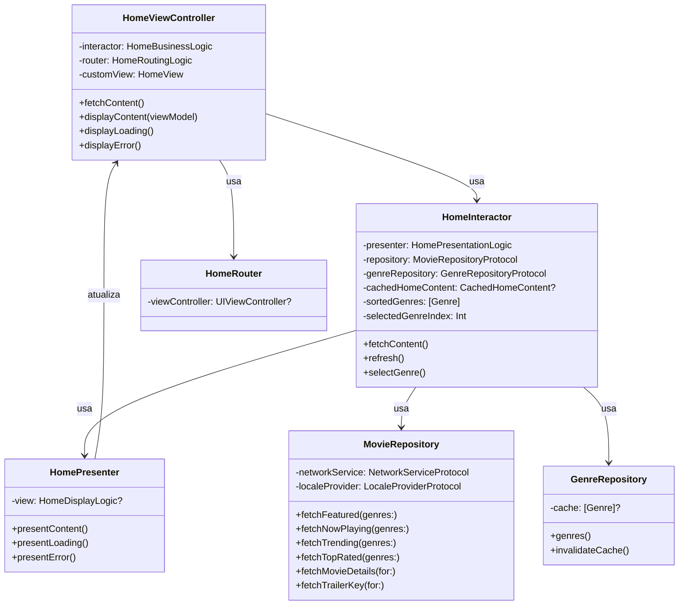
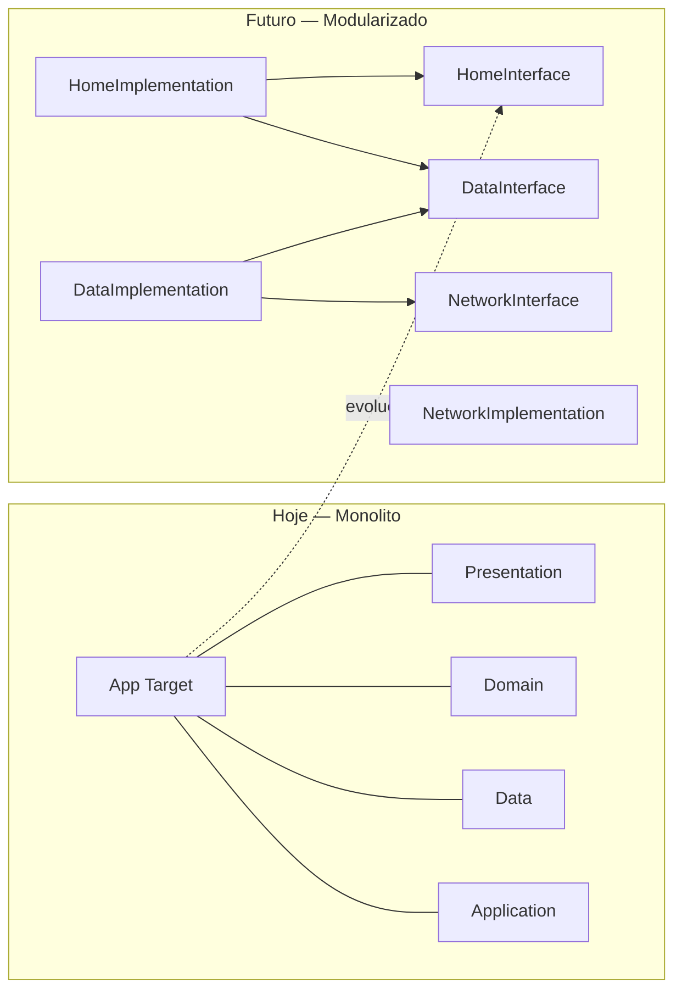

# Cineteca — Documentação do Projeto

> Documento de referência para discussão técnica com engenheiro iOS especialista.  
> Última atualização: agosto/2026.

---

## Sumário

1. [Visão geral](#1-visão-geral)
2. [Stack técnico](#2-stack-técnico)
3. [Arquitetura](#3-arquitetura)
4. [Estrutura do projeto](#4-estrutura-do-projeto)
5. [Funcionalidades](#5-funcionalidades)
6. [Modelos de dados](#6-modelos-de-dados)
7. [API e integrações](#7-api-e-integrações)
8. [Fluxos principais](#8-fluxos-principais)
9. [Estado e concorrência](#9-estado-e-concorrência)
10. [Navegação](#10-navegação)
11. [Localização](#11-localização)
12. [UI e convenções](#12-ui-e-convenções)
13. [Build e setup](#13-build-e-setup)
14. [Gaps e pontos de discussão](#14-gaps-e-pontos-de-discussão)
15. [Diagramas UML — Use Cases](#15-diagramas-uml--use-cases)
16. [Diagramas UML — Arquitetura](#16-diagramas-uml--arquitetura)

---

## 1. Visão geral

**Cineteca** é um app iOS nativo de catálogo e descoberta de filmes, integrado à API do [The Movie Database (TMDB)](https://www.themoviedb.org/).

| Aspecto | Detalhe |
|---|---|
| **Propósito** | Exibir filmes populares, em cartaz, em alta e mais bem avaliados, com filtro por gênero |
| **Público** | App pessoal/portfólio com UI dark polida |
| **Estado atual** | Home e **Movie Details** implementadas; Search, Lists, Stats e Profile são placeholders |
| **Bundle ID** | `com.gilson.cineteca` |
| **Versão** | 1.0 (1) |
| **iOS mínimo** | 17.0 |

### O que o app faz hoje

- Carrega gêneros e 4 listas de filmes do TMDB (gêneros primeiro, filmes em paralelo)
- Exibe hero em destaque, filtro de gênero por chips, 3 seções horizontais e card promocional
- Filtra por gênero **no cliente** (sem nova chamada à API)
- Suporta pull-to-refresh, skeleton loading e tela de erro com retry
- Localiza UI em `en` e `pt-BR`; nomes de gênero vêm da API no idioma configurado

### O que ainda não faz

- Navega para detalhe do filme e assiste trailer (YouTube)
- Watchlist, "Ver tudo", notificações
- Persistência local, testes automatizados, CI/CD

---

## 2. Stack técnico

| Camada | Tecnologia |
|---|---|
| Linguagem | Swift 5.0 |
| UI | UIKit (100% programático, sem Storyboards) |
| Layout | [Cartography](https://github.com/robb/Cartography) 4.x (Auto Layout DSL) |
| Arquitetura de apresentação | VIP (View-Interactor-Presenter) |
| Networking | `URLSession` + `async/await` |
| Concorrência | `Task`, `actor` (cache de gêneros), `MainActor` para UI |
| Injeção de dependências | Manual via `AppDependencies` + `Configurator` por cena |
| Localização | `Localizable.strings` + enum type-safe `Strings` |
| Dependências externas | 1 pacote SPM (Cartography) |
| Persistência | Nenhuma |

### Frameworks Apple utilizados

`UIKit`, `Foundation` — sem SwiftUI, Combine, Core Data, Keychain ou UserDefaults.

### Baseline arquitetural

O projeto segue as diretrizes documentadas em `architecture.md`, alinhadas ao padrão iFood iOS:

- **Repository-first**: repositório é a única fronteira obrigatória de dados
- **UseCase e DataSource são opcionais** — não usados neste projeto
- **Sem framework reativo** (Combine/RxSwift)
- VIP para UIKit; MVVM seria o padrão para SwiftUI (não aplicável aqui)

---

## 3. Arquitetura

### 3.1 Camadas

```
┌─────────────────────────────────────────────────────────┐
│                    PRESENTATION                         │
│  VIP: ViewController ↔ Interactor ↔ Presenter ↔ View   │
│  + Router (stub) + Configurator (DI da cena)           │
├─────────────────────────────────────────────────────────┤
│                      DOMAIN                             │
│  Entidades (Genre, Movie, MovieDetails)                │
│  Protocolos de repositório (Movie, Genre)              │
├─────────────────────────────────────────────────────────┤
│                       DATA                              │
│  Repositórios, Responses, Endpoints, NetworkService      │
├─────────────────────────────────────────────────────────┤
│                   APPLICATION                           │
│  AppDependencies (composition root), LocaleProvider        │
└─────────────────────────────────────────────────────────┘
```

| Camada | Responsabilidade | Depende de |
|---|---|---|
| **Presentation** | UI, eventos do usuário, formatação para exibição | Protocolos de Domain/Data |
| **Domain** | Entidades e contratos (`*RepositoryProtocol`) | Nada de UIKit ou networking |
| **Data** | Implementação de repositórios, Responses da API, HTTP | Infra de rede |
| **Application** | Wiring global do app | Todas as camadas |

### 3.2 Padrão VIP na cena Home

```
User Action
    ↓
HomeViewController (DisplayLogic)
    ↓
HomeInteractor (BusinessLogic)     ← orquestração, cache, filtro
    ↓
HomePresenter (PresentationLogic)  ← Movie → ViewModel
    ↓
HomeViewController.display*()
    ↓
HomeView + Subviews                ← renderização pura
```

| Componente | Arquivo | Papel |
|---|---|---|
| `HomeViewController` | `HomeViewController.swift` | Implementa `HomeDisplayLogic`; encaminha eventos ao Interactor |
| `HomeInteractor` | `HomeInteractor.swift` | Lógica de negócio: fetch paralelo, cache, filtro por gênero |
| `HomePresenter` | `HomePresenter.swift` | Mapeia `Movie` → `FeaturedViewModel`, `MovieCardViewModel` |
| `HomeRouter` | `HomeRouter.swift` | **Stub vazio** — navegação ainda não implementada |
| `HomeConfigurator` | `HomeConfigurator.swift` | Monta e injeta dependências da cena |
| `HomeView` + subviews | `HomeView.swift`, `Subviews/` | Views desacopladas; delegates para eventos |

### 3.3 Repository-first (sem UseCase)

```swift
// Fluxo típico de dados
HomeInteractor
    → GenreRepository.genres()  // actor com cache; retorna [Genre]
    → MovieRepository.fetchNowPlaying(genres:)
        → NetworkService.request(MovieEndpoint.nowPlaying)
        → MovieResponse.toDomain(genreLookup:)
```

**Por que não há UseCase?** A regra de negócio (filtro por gênero, resolução do featured) vive no `HomeInteractor`, que já orquestra dois repositórios. Um UseCase que apenas repassasse chamadas ao repositório não agregaria valor — conforme `architecture.md`.

### 3.4 Composition Root

`AppDependencies` é o único ponto de montagem global:

```swift
AppDependencies()
    → NetworkService (TMDB, Bearer token)
    → LocaleProvider
    → GenreRepository (actor)
    → MovieRepository
    → MainTabBarController
```

Cada cena tem seu próprio `Configurator` para o wiring VIP local. O
`Configurator` monta `ViewController`, `Interactor`, `Presenter` e `Router`;
ele não deve ser chamado diretamente por outro Router.

Quando um Router precisa abrir outra cena, recebe o protocolo
`<Scene>Building` correspondente. Os builders ficam na camada `Application` e
são implementados pelo `AppDependencies`, que delega a criação ao
`Configurator` da cena de destino:

```text
ProfileRouter
    → AccountBuilding
    → AppDependencies
    → AccountConfigurator
    → AccountViewController
```

Builders são necessários para cenas criadas por outros Routers. Cenas criadas
diretamente pela composição inicial, como as tabs raiz, não precisam de um
builder apenas para serem instanciadas.

---

## 4. Estrutura do projeto

```
cineteca/
├── cineteca.xcodeproj/
└── cineteca/
    ├── AppDelegate.swift                 # Entry point, UIWindow
    ├── Info.plist
    ├── Keys.plist                        # ⚠️ Gitignored — API_KEY do TMDB
    │
    ├── Application/
    │   ├── AppDependencies.swift         # Composition root
    │   ├── SceneBuilders.swift           # Contratos de criação das cenas
    │   └── LocaleProvider.swift          # Device locale → TMDB language
    │
    ├── Domain/
    │   ├── Models/
    │   │   ├── Genre.swift               # Entidade de domínio
    │   │   ├── Movie.swift               # Entidade de domínio
    │   │   └── MovieDetails.swift        # Entidade de domínio (+ cast, crew, providers)
    │   └── Repositories/
    │       ├── MovieRepositoryProtocol.swift
    │       └── GenreRepositoryProtocol.swift
    │
    ├── Data/
    │   ├── Endpoints/
    │   │   ├── MovieEndpoint.swift
    │   │   └── GenreEndpoint.swift
    │   ├── Models/
    │   │   ├── MovieResponse.swift         # Response + mapping → Movie
    │   │   ├── MovieDetailsResponse.swift  # Response + mapping → MovieDetails
    │   │   └── GenreResponse.swift         # Response + mapping → Genre
    │   ├── Networking/
    │   │   ├── NetworkService.swift
    │   │   ├── NetworkConfiguration.swift
    │   │   ├── URLRequestBuilder.swift
    │   │   ├── HTTPMethod.swift
    │   │   ├── NetworkError.swift
    │   │   ├── APIKeys.swift
    │   │   └── ParameterEncoding.swift
    │   └── Repositories/
    │       ├── MovieRepository.swift
    │       └── GenreRepository.swift   # actor
    │
    ├── Presentation/
    │   ├── Helpers/
    │   │   ├── Strings.swift             # Chaves type-safe
    │   │   ├── ShimmerView.swift
    │   │   └── UIImageView+AsyncLoad.swift
    │   └── Scenes/
    │       ├── TabBar/MainTabBarController.swift
    │       └── Home/                     # Cena Home (VIP)
    │           ├── ...
    │       └── MovieDetails/             # Cena Movie Details (VIP)
    │           ├── MovieDetailsConfigurator.swift
    │           ├── MovieDetailsInteractor.swift
    │           ├── MovieDetailsPresenter.swift
    │           ├── MovieDetailsRouter.swift
    │           ├── MovieDetailsModels.swift
    │           ├── MovieDetailsViewController.swift
    │           ├── MovieDetailsView.swift
    │           └── Subviews/...
    │
    ├── Assets.xcassets/                  # Cores: AppBackground, CardBackground, AccentYellow, TextSecondary
    ├── en.lproj/Localizable.strings
    ├── pt-BR.lproj/Localizable.strings
    │
    ├── README.md
    ├── architecture.md
    ├── view-conventions.md
    └── DOCUMENTACAO-PROJETO.md           # Este arquivo
```

---

## 5. Funcionalidades

### 5.1 Implementadas

| Feature | Descrição | Camada principal |
|---|---|---|
| **Feed da Home** | Hero + 3 seções horizontais + weekly digest | `HomeView`, subviews |
| **Carregamento da Home** | 1 request de gêneros + 4 requests de filmes em paralelo | `HomeInteractor.loadContent()` |
| **Pull-to-refresh** | Invalida cache de gêneros e recarrega tudo | `HomeInteractor.refresh()` |
| **Filtro por gênero** | Chips horizontais; filtro instantâneo no cliente por `Genre.id` | `HomeInteractor`, `GenreFilterView` |
| **Detalhe do filme** | Tela VIP com overview, cast, crew, providers e similares | `MovieDetails/` |
| **Trailer** | Abre YouTube (app ou web) a partir da Home ou Movie Details | `HomeRouter`, `MovieDetailsRouter` |
| **Skeleton loading** | Shimmer placeholders no layout final | `HomeSkeletonView` |
| **Estado de erro** | Tela cheia com botão retry | `HomeErrorStateView` |
| **Imagens assíncronas** | Posters/backdrops do CDN TMDB | `UIImageView+AsyncLoad` |
| **Localização** | UI em en/pt-BR; gêneros da API no idioma do device | `Strings`, `LocaleProvider` |

### 5.2 Seções da Home

| Seção | Fonte de dados | Comportamento |
|---|---|---|
| **Featured (hero)** | 1º filme de `/movie/popular` | Backdrop, rating, ano, chips de gênero, botões Watch Trailer / Watchlist |
| **Filtro de gênero** | `/genre/movie/list` + chip "All/Todos" | Ordenação alfabética; índice 0 = sem filtro |
| **Now Playing** | `/movie/now_playing` | `UICollectionView` horizontal |
| **Trending** | `/trending/movie/week` | Cards com badge "Trending" |
| **Top Rated** | `/movie/top_rated` | `UICollectionView` horizontal |
| **Weekly Digest** | Hardcoded | Card promocional estático, sem binding de dados |

### 5.3 Placeholders / não funcionais

| Item | Status |
|---|---|
| Aba Search | `UIViewController` vazio |
| Aba Lists | `UIViewController` vazio |
| Aba Stats | `UIViewController` vazio |
| Aba Profile | `UIViewController` vazio |
| Botão Watch Trailer | Funcional (Home e Movie Details) |
| Tap em card de filme | Navega para Movie Details |
| `HomeRouter` | Navega para Movie Details e trailer |
| Weekly Digest | Strings hardcoded |

---

## 6. Modelos de dados

### 6.1 Entidades de domínio (`Domain/Models/`)

**`Genre`**

```swift
struct Genre: Sendable, Hashable {
    let id: Int
    let name: String
}
```

**`Movie`**

```swift
struct Movie: Sendable {
    let id: Int
    let title: String
    let posterURL: URL?       // TMDB CDN w500
    let backdropURL: URL?     // TMDB CDN w780
    let releaseYear: String   // Primeiros 4 chars de releaseDate
    let rating: Double        // voteAverage
    let genres: [Genre]       // Resolvidos via genreLookup no mapping
    let runtime: Int?         // Presente no model; não populado pelos endpoints de lista
}
```

**`MovieDetails`** — agrega `Movie` + overview, cast, crew, watch providers e filmes similares. Tipos auxiliares: `MovieCastMember`, `MovieCrewMember`, `WatchProvider`.

**Regra de organização:** entidades de domínio ficam em `Domain/Models/`; Responses da API ficam em `Data/Models/`.

### 6.2 Responses da API

| Tipo | Campos principais |
|---|---|
| `MovieResponse` | `id`, `title`, `posterPath`, `backdropPath`, `releaseDate`, `voteAverage`, `genreIds`, `runtime` |
| `MovieListResponse` | `results: [MovieResponse]` |
| `GenreResponse` | `id`, `name` |
| `GenreListResponse` | `genres: [GenreResponse]` |

**Mapping:**

- `GenreResponse.toDomain()` → `Genre`
- `MovieResponse.toDomain(genreLookup:)` constrói URLs de imagem e resolve `genreIds` → `[Genre]`
- `MovieDetailsResponse.toDomain(...)` mapeia gêneros, cast, crew e providers

### 6.3 View Models (Presentation)

| Tipo | Uso |
|---|---|
| `FeaturedViewModel` | Seção hero (title, year, rating, genres, backdropURL) |
| `MovieCardViewModel` | Card horizontal (id, title, rating, posterURL, isTrending) |
| `GenreFilter` / `GenreFilterViewModel` | `[Genre]` no domínio/interactor; opções de chip (`[String]`) + índice selecionado na UI |
| `HomeModels.FetchContent.*` | Request/Response/ViewModel do fluxo VIP |
| `HomeModels.SelectGenre.Request` | Índice do chip selecionado |

### 6.4 Cache interno do Interactor

```swift
private struct CachedHomeContent {
    let featured: Movie
    let nowPlaying: [Movie]
    let trending: [Movie]
    let topRated: [Movie]
}
```

Armazena listas **antes** do filtro. `selectGenre()` reutiliza este cache sem rede.

---

## 7. API e integrações

### 7.1 TMDB API v3

| Config | Valor |
|---|---|
| Base URL | `https://api.themoviedb.org/3` |
| Autenticação | Bearer token v4 no header `Authorization` |
| Idioma | Query param `language` via `LocaleProvider.apiLanguage` |
| Token | `Keys.plist` → chave `API_KEY` (gitignored) |

### 7.2 Endpoints utilizados

| Endpoint | HTTP | Path | Uso |
|---|---|---|---|
| `MovieEndpoint.featured` | GET | `/movie/popular` | Hero (1º resultado) |
| `MovieEndpoint.nowPlaying` | GET | `/movie/now_playing` | Seção "Em cartaz" |
| `MovieEndpoint.trending` | GET | `/trending/movie/week` | Seção "Em alta" |
| `MovieEndpoint.topRated` | GET | `/movie/top_rated` | Seção "Mais bem avaliados" |
| `GenreEndpoint.movieList` | GET | `/genre/movie/list` | Chips de filtro + resolução de nomes |

### 7.3 CDN de imagens (fora do NetworkService)

| Asset | URL base |
|---|---|
| Posters | `https://image.tmdb.org/t/p/w500` + `posterPath` |
| Backdrops | `https://image.tmdb.org/t/p/w780` + `backdropPath` |

Carregadas via `UIImageView.loadImage(from:)` com `URLSession.shared`.

### 7.4 Camada de rede

| Tipo | Responsabilidade |
|---|---|
| `NetworkServiceProtocol` | `request<T: Decodable>(_ builder:) async throws -> T` |
| `URLRequestBuilder` | Protocolo: path, method, query, headers, body |
| `NetworkConfiguration` | Base URL + headers padrão |
| `NetworkError` | Erros tipados (401, 403, 404, 5xx, decoding, underlying) |

### 7.5 Contratos dos repositórios

```swift
protocol MovieRepositoryProtocol {
    func fetchNowPlaying(genres: [Genre]) async throws -> [Movie]
    func fetchTrending(genres: [Genre]) async throws -> [Movie]
    func fetchTopRated(genres: [Genre]) async throws -> [Movie]
    func fetchFeatured(genres: [Genre]) async throws -> [Movie]
    func fetchMovieDetails(for movieId: Int) async throws -> MovieDetails
    func fetchTrailerKey(for movieId: Int) async throws -> String?
}

protocol GenreRepositoryProtocol {
    func genres() async throws -> [Genre]
    func invalidateCache() async
}
```

O `HomeInteractor` chama `genres()` uma vez e repassa `[Genre]` para cada `fetch*` do `MovieRepository`. O filtro por gênero usa `genre.id`, não o nome. O `MovieRepository` não depende de `GenreRepository`.

---

## 8. Fluxos principais

### 8.1 Carregamento inicial da Home

```
1. HomeViewController.viewDidLoad()
2. interactor.fetchContent(request:)
3. presenter.presentLoading() → skeleton
4. loadContent():
   a. genreRepository.genres() — uma request (ou cache hit)
   b. 4 async let em paralelo: fetchFeatured/NowPlaying/Trending/TopRated(genres:)
5. sortedGenres = gêneros ordenados por nome; chip "All/Todos" no índice 0
6. Salva CachedHomeContent
7. presentFilteredContent() → aplica filtro atual
8. presenter.presentContent() → HomeView exibe conteúdo
```

### 8.2 Filtro por gênero (sem rede)

```
1. Usuário toca chip em GenreFilterView
2. Delegate chain: GenreFilterView → HomeContentView → HomeView → HomeViewController
3. interactor.selectGenre(index:)
4. Atualiza selectedGenreIndex
5. presentFilteredContent(from: cachedHomeContent)
6. presenter.presentContent() → UI atualiza instantaneamente
```

**Regras de filtro:**

- Índice 0 ("All"/"Todos"): sem filtro
- Demais índices: filmes cujo `Movie.genres` contém um `Genre` com o mesmo `id`

**Regras do featured ao filtrar:**

1. Sem gênero selecionado → featured original
2. Featured já tem o gênero → mantém
3. Senão → primeiro match em nowPlaying → trending → topRated
4. Nenhum match → mantém featured original

### 8.3 Pull-to-refresh

```
1. UIRefreshControl dispara refresh
2. genreRepository.invalidateCache() — limpa cache do actor
3. loadContent() — busca tudo de novo
4. selectedGenreIndex preservado; filtro reaplicado nos dados novos
```

### 8.4 Tratamento de erro

```
loadContent() catch → presenter.presentError(error)
    → HomeView.showError()
    → HomeErrorStateView com botão Retry
    → Retry chama fetchContent() novamente
```

---

## 9. Estado e concorrência

### 9.1 Onde o estado vive

| Estado | Dono | Mecanismo |
|---|---|---|
| Cache de conteúdo da Home | `HomeInteractor` | `cachedHomeContent`, `sortedGenres`, `selectedGenreIndex` |
| Cache de gêneros da API | `GenreRepository` (actor) | `cache: [Genre]?` in-memory |
| Estado visual (loading/content/error) | `HomeView` | `enum State { loading, content, error }` |
| Seleção de chip | `GenreFilterView` | `options` + `selectedIndex` via `configure` |

### 9.2 Sem framework reativo

Fluxo unidirecional imperativo:

```
User → Delegate → ViewController → Interactor → Repository
    → Interactor → Presenter → ViewController.display*() → View
```

### 9.3 Concorrência Swift

- `async/await` em repositórios e interactor
- `GenreRepository` é `actor` — thread-safe para cache
- UI updates via `await MainActor.run { ... }` no interactor
- `Sendable` em protocolos, Responses da API e entidades de domínio (`Genre`, `Movie`, `MovieDetails`)

### 9.4 Por que filtrar no cliente?

- Resposta instantânea ao trocar gênero
- Menos chamadas de rede (endpoints de lista não suportam filtro por gênero)
- Todas as seções partem do mesmo snapshot do último refresh

---

## 10. Navegação

### 10.1 Estrutura atual

```
AppDelegate
  └── UIWindow
        └── MainTabBarController
              ├── UINavigationController → Home (implementada)
              ├── UINavigationController → Search (placeholder)
              ├── UINavigationController → Lists (placeholder)
              ├── UINavigationController → Stats (placeholder)
              └── UINavigationController → Profile (placeholder)
```

### 10.2 Home

- Navigation bar oculta (`setNavigationBarHidden(true)`)
- `HomeRouter` navega para Movie Details e abre trailer no YouTube
- Sem deep linking, sem Coordinator pattern
- Sem SceneDelegate — lifecycle clássico via `AppDelegate`

### 10.3 Cadeia de delegates (eventos)

```
GenreFilterViewDelegate
    → HomeContentViewDelegate
        → HomeViewDelegate
            → HomeViewController
                → HomeInteractor

HomeErrorStateViewDelegate → (mesma cadeia)
UIRefreshControl → (mesma cadeia)
```

---

## 11. Localização

| Concern | Fonte |
|---|---|
| Labels, botões, títulos de aba | Device locale → `Strings` enum → `Localizable.strings` |
| Nomes de gênero nos filmes | `LocaleProvider.apiLanguage` → param `language` da API TMDB |

**Mapeamento de locale:**

| Device | API language |
|---|---|
| `pt*` | `pt-BR` |
| Outros | `en-US` |

Arquivos: `en.lproj/Localizable.strings`, `pt-BR.lproj/Localizable.strings`

---

## 12. UI e convenções

Documentadas em `view-conventions.md`:

- UI 100% programática — `required init?(coder:)` retorna `nil` em todos os lugares
- `// MARK: -` em ordem fixa por arquivo
- `private lazy var` para componentes de UI
- Cartography: um `constrain<Component>()` por subview
- Cells em arquivos separados com `static let reuseId`
- Views expõem `configure(viewModel:)` — sem lógica de negócio na UI

### Paleta dark

| Cor (Asset) | Uso |
|---|---|
| `AppBackground` | Fundo geral (~#101010) |
| `CardBackground` | Cards e seções |
| `AccentYellow` | Destaques, tab selecionada |
| `TextSecondary` | Texto secundário, ícones inativos |

### Limitações do image loader

`UIImageView+AsyncLoad`:
- Sem cancelamento de task no reuse (apenas limpa imagem em `prepareForReuse`)
- Sem cache de imagens
- `taskKey` declarado mas não utilizado

---

## 13. Build e setup

### Pré-requisitos

1. Xcode 15+
2. Criar `cineteca/Keys.plist`:
   ```xml
   <?xml version="1.0" encoding="UTF-8"?>
   <!DOCTYPE plist PUBLIC "-//Apple//DTD PLIST 1.0//EN" "http://www.apple.com/DTDs/PropertyList-1.0.dtd">
   <plist version="1.0">
   <dict>
       <key>API_KEY</key>
       <string>SEU_TOKEN_TMDB_V4</string>
   </dict>
   </plist>
   ```
3. Abrir `cineteca.xcodeproj`
4. Build & Run em simulador iOS 17+

### Configurações de build

| Setting | Valor |
|---|---|
| Target | `cineteca` (app único) |
| iOS Deployment Target | 17.0 |
| Devices | iPhone + iPad |
| Orientação | Portrait only |
| Code signing | Automatic |
| Info.plist | Manual (`GENERATE_INFOPLIST_FILE = NO`) |

### Não presente no repo

- Fastlane
- CI/CD (GitHub Actions, GitLab CI)
- TestFlight / App Store config
- Target de testes (unit/UI)
- `Package.resolved` commitado

---

## 14. Gaps e pontos de discussão

Sugestões de tópicos para a conversa com o engenheiro iOS:

| # | Tópico | Contexto |
|---|---|---|
| 1 | **Próximas features** | Detalhe do filme, busca, watchlist — `HomeRouter` pronto para crescer |
| 2 | **UseCase vs Interactor** | Regra de filtro no Interactor é suficiente? Quando extrair? |
| 3 | **Modularização** | Monolito hoje; `architecture.md` descreve split Interface/Implementation |
| 4 | **Testes** | Zero cobertura; `HomeInteractor` (filtro) é o primeiro candidato |
| 5 | **Image loading** | Trocar loader custom por Nuke/Kingfisher? Cancelamento de task? |
| 6 | **Persistência** | Cache in-memory apenas; watchlist precisaria Core Data/SwiftData/UserDefaults |
| 7 | **iOS 17 baseline** | Permite concurrency moderna sem preocupação com retrocompat |
| 8 | **Delegates vs closures** | Cadeia de 4 delegates na Home — alternativas? |
| 9 | **VIP boilerplate** | Vale a pena para cenas simples? Quando usar MVVM-C? |
| 10 | **Acessibilidade** | Sem labels/hints explícitos nas views customizadas |

### Seams naturais para testes

| Camada | O que testar |
|---|---|
| `HomeInteractor` | Filtro por gênero, resolução do featured, reuso de cache |
| `HomePresenter` | Formatação de rating, mapeamento para ViewModels |
| `MovieRepository` | Response → domain com mock de `NetworkService` |
| `GenreRepository` | Cache hit, `invalidateCache` |
| `NetworkService` | Mapeamento de status codes, erros de decoding |
| `LocaleProvider` | `pt` → `pt-BR`, fallback → `en-US` |

---

## 15. Diagramas UML — Use Cases

### 15.1 Visão geral do sistema



### 15.2 Use Cases — Aba Home (implementados)



### 15.3 Use Cases — Planejados (não implementados)

```mermaid
graph TB
    subgraph Atores
        U((Usuário))
        API((TMDB API))
    end

    subgraph "Cineteca — Roadmap"
        UC_SEARCH[Buscar filmes]
        UC_DETAIL[Ver detalhe do filme]
        UC_TRAILER[Assistir trailer]
        UC_WATCHLIST[Adicionar à watchlist]
        UC_LISTS[Gerenciar listas]
        UC_STATS[Ver estatísticas]
        UC_PROFILE[Gerenciar perfil]
        UC_NOTIFY[Receber notificações]
        UC_SEEALL[Ver lista completa]
    end

    U -.->|futuro| UC_SEARCH
    U -.->|futuro| UC_DETAIL
    U -.->|futuro| UC_TRAILER
    U -.->|futuro| UC_WATCHLIST
    U -.->|futuro| UC_LISTS
    U -.->|futuro| UC_STATS
    U -.->|futuro| UC_PROFILE
    U -.->|futuro| UC_NOTIFY
    U -.->|futuro| UC_SEEALL

    UC_DETAIL -.->|include| UC_TRAILER
    UC_DETAIL -.->|include| UC_WATCHLIST
    UC_SEARCH -.-> API
    UC_DETAIL -.-> API

    style UC_SEARCH fill:#333,stroke:#666,stroke-dasharray: 5 5
    style UC_DETAIL fill:#333,stroke:#666,stroke-dasharray: 5 5
    style UC_TRAILER fill:#333,stroke:#666,stroke-dasharray: 5 5
    style UC_WATCHLIST fill:#333,stroke:#666,stroke-dasharray: 5 5
    style UC_LISTS fill:#333,stroke:#666,stroke-dasharray: 5 5
    style UC_STATS fill:#333,stroke:#666,stroke-dasharray: 5 5
    style UC_PROFILE fill:#333,stroke:#666,stroke-dasharray: 5 5
    style UC_NOTIFY fill:#333,stroke:#666,stroke-dasharray: 5 5
    style UC_SEEALL fill:#333,stroke:#666,stroke-dasharray: 5 5
```



### 15.4 Diagrama de casos de uso — Filtro por gênero (detalhe)



### 15.5 Diagrama de casos de uso — Carregamento inicial



---

## 16. Diagramas UML — Arquitetura

### 16.1 Diagrama de componentes



### 16.2 Diagrama de classes — VIP Home (simplificado)



### 16.3 Diagrama de pacotes / módulos (estado atual vs futuro)



---

## Referências rápidas

| Documento | Conteúdo |
|---|---|
| [README.md](README.md) | Setup, Home, filtro por gênero |
| [architecture.md](architecture.md) | Baseline iFood, VIP/MVVM, quando usar UseCase/DataSource |
| [view-conventions.md](view-conventions.md) | Padrões de UI, Cartography, delegates |

---

*Gerado para apoio à discussão técnica. Para contribuir, leia os três documentos acima antes de alterar código de UI ou arquitetura.*
